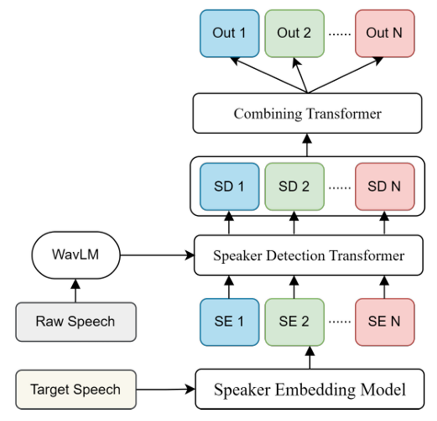

# TS-VAD+ : A Transformer-based Approach for Speaker Diarization

## Model Summary

TS-VAD+ is a transformer-based speaker diarization system designed to detect "who spoke when" in multi-speaker audio. It processes two inputs: (1) raw speech, encoded using a WavLM model into frame-level acoustic features, and (2) speaker profiles, extracted from single-speaker audio segments using ECAPA-TDNN embeddings. These inputs are passed through a two-stage transformer architecture—first to perform independent speaker activity detection for each speaker, and then to integrate outputs into a unified probability stream. The final predictions are postprocessed to generate RTTM files. Compared to traditional clustering-based pipelines and EEND models, TS-VAD+ is more robust in overlapping speech scenarios and requires less training data.

<p align="center">
  
</p>

<p align="center"><em>Figure: TS-VAD+ model architecture showing WavLM-based speech encoding, ECAPA-TDNN embeddings, and dual transformer stages for speaker diarization</em></p>


## Improvements Over Baseline TS-VAD

This repository presents TS-VAD+, a significant enhancement over the original TS-VAD diarization model. The following upgrades were implemented:

- **ECAPA-TDNN Speaker Embeddings**: Replaced traditional i-vectors with ECAPA-TDNN to improve speaker representation and robustness in noisy and overlapping speech.
- **WavLM-based Feature Extraction**: Integrated a WavLM encoder, pre-trained on noisy and multi-speaker scenarios, for more discriminative acoustic features.
- **Wideband Simulated Pretraining**: Developed a 16kHz simulated dataset from LibriSpeech for better domain adaptation to DIHARD III data.
- **Improved Clustering**: Used VBx instead of x-vector clustering, reducing DER significantly before model input.
- **Memory-Aware Attention (mm-TS-VAD+)**: Introduced a memory module that dynamically refines speaker embeddings using external cluster centroids.
- **Data Augmentation**: Mixed single- and two-speaker DIHARD III recordings to generate new, realistic overlapping speech conditions.
- **VAD Postprocessing**: Applied pyannote’s VAD to further clean false alarms and reduce overall DER.

## Results Summary on DIHARD III (Track 2)

| Model                         | DER (%) |
|-------------------------------|---------|
| VBx-HMM with OSD              | 21.97   |
| EEND                          | 20.05   |
| mm-TS-VAD+ with Augmentation  | 22.36   |
| TS-VAD+ (our best model)      | 19.11   |
| SOTA (ANSD-MA-MSE)            | 16.76   |

The best TS-VAD+ configuration (ECAPA-TDNN + WavLM + VBx + VAD) achieves a DER of **19.11%** improving upon intial result of **22.57%** and surpassing other models such as VBx-HMM and EEND, particularly in high-overlap scenarios such as meetings and restaurants.

---
## Installation
### Clone the repo and create a new virtual environment

Clone the repo:
```
git clone -b adnan https://github.com/TonnyTran/TSVAD_pytorch.git
cd TSVAD_pytorch
```
Using conda to create a fresh virtual environment with the dependencies, and activate it:
```
conda env create --name tsvad --file=tsvad.yaml
conda activate tsvad
```
**Note:** After cloning the repository, unzip the `tools.zip` located in the `ts-vad/` directory so that all required scripts and utilities are available.

## Add pre-trained libraries

- Add [WavLM-Base+.pt](https://drive.google.com/file/d/1-zlAj2SyVJVsbhifwpTlAfrgc9qu-HDb/view?usp=share_link) in `ts-vad/pretrained_models` (build this folder)

- Add [ecapa-tdnn.model](https://drive.google.com/file/d/1E-ju12Jy1fID2l4x-nj0zB5XUHSKWsRB/view?usp=drive_link) to `ts-vad/pretrained_models`

- We use musan and rirs for data augmentation and you can pass these parameters in `run_train.sh`. Download [musan](https://www.openslr.org/17/) and [rirs noise](https://www.openslr.org/28/).


## Prepare DIHARD3

- Download DIHARD3 dataset
```
pip install gdown
gdown --folder 1S3RqdbUszN1nRjUAmtm_PvrBDtnXn65Z
```
- The dataset looks like

        # DIHARD3
        # ├── third_dihard_challenge_dev 
        # |   ├──── data
        # │     ├── flac
        # │     ├── rttm
        # |     ├── sad
        # |     ├── uem
        # |     ├── uem_scoring
        # ├── third_dihard_challenge_eval 
        # |   ├──── data
        # │     ├── flac
        # │     ├── rttm
        # |     ├── sad
        # |     ├── uem
        # |     ├── uem_scoring

- Install sox using `sudo apt-get install sox`. Create a folder `wav` in `third_dihard_challenge_dev` and `third_dihard_challenge_eval`. Convert all flac audios to wav and keep it in this folder `wav`.

- For the `wav` directory, you can use this script. This creates the `wav` folder in the same parent directory as `flac` and converts each `.flac` file to `.wav`. Install `sox` using `sudo apt-get install sox` before running the below script:  
```mkdir -p "flac/wav" && find "flac" -type f -name "*.flac" -exec sh -c 'sox "{}" "$(dirname "{}")/wav/$(basename "{}" .flac).wav"' \; && mv "flac/wav" .```.

### Downsampling and Upsampling

For best results, we found that matching the DIHARD3 data with the simulated pretraining data gives better results. Simulated data is upsampled from 8K to 16K.

To mimic 8K to 16K, we first downsample 16K DIHARD3 wav to 8K and then upsample back to 16K. This boosts the TS-VAD results on DIHARD3 significantly.

To make this change simply run below code inside `wav` folders:
```for file in *.wav; do sox -G "$file" -r 8000 temp.wav; sox -G temp.wav -r 16000 "${file%.wav}_converted.wav"; done; rm temp.wav```

DEV: ```rm DH_DEV_*[0-9].wav && rename 's/_converted//' *_converted.wav```  
EVAL: ```rm DH_EVAL_*[0-9].wav && rename 's/_converted//' *_converted.wav```

### Prepare Target Audio and Embeddings

- Execute `ts-vad/prepare/prepare_dihard.sh` to get `target_audio` and `target_embeddings` and `ts_***.json` file

- In `third_dihard_challenge_eval/data/rttm`, run command `cat *.rttm > all.rttm`. This will be used later to get the DER scores. Rest of the rttm files should be replaced with clustering model rttm files.
[NOTE: all.rttm should be from the ground truth (since it is used to calculate DER) and data/rttm should have the clustering model rttm results]

- Following these steps your DIHARD3 directory should have these files and folders to run the TS-VAD model:

        # DIHARD3
        # ├── third_dihard_challenge_dev 
        # |   ├──── data
        # │     ├── wav
        # |         |── DH_DEV_****.wav
        # |         |── ....
        # |         |── DH_DEV_****.wav
        # │     ├── rttm
        # |         |── DH_DEV_****.rttm
        # |         |── ....
        # |         |── DH_DEV_****.rttm
        # |     ├── target_audio
        # │         |── DH_DEV_****
        # │             ├── <eachspeaker.wav> and <all.wav>
        # |         |── ...
        # │         |── DH_DEV_****
        # │             ├── <eachspeaker.wav> and <all.wav>
        # |     ├── target_embeddings
        # │         |── DH_DEV_****
        # │             ├── <eachspeaker.pt>
        # |         |── ...
        # │         |── DH_DEV_****
        # │             ├── <eachspeaker.pt>
        # |     ├── ts_dev.json
        # ├── third_dihard_challenge_eval 
        # |   ├──── data
        # │     ├── wav
        # |         |── DH_EVAL_****.wav
        # |         |── ....
        # |         |── DH_EVAL_****.wav
        # │     ├── rttm
        # |         |── all.rttm
        # |         |── DH_EVAL_****.rttm
        # |         |── ....
        # |         |── DH_EVAL_****.rttm
        # |     ├── target_audio
        # │         |── DH_EVAL_****
        # │             ├── <eachspeaker.wav> and <all.wav>
        # |         |── ...
        # │         |── DH_EVAL_****
        # │             ├── <eachspeaker.wav> and <all.wav>
        # |     ├── target_embeddings
        # │         |── DH_EVAL_****
        # │             ├── <eachspeaker.pt>
        # |         |── ...
        # │         |── DH_EVAL_****
        # │             ├── <eachspeaker.pt>
        # |     ├── ts_eval.json

## Usage

- Edit `run_train.sh` file with correct parameters. You should also pass musan and rirs path here.

- A sample script looks like this:

```
python main.py \
--train_list DIHARD3/third_dihard_challenge_dev/data/ts_dev.json \
--eval_list DIHARD3/third_dihard_challenge_eval/data/ts_eval.json \
--train_path DIHARD3/third_dihard_challenge_dev/data \
--eval_path DIHARD3/third_dihard_challenge_eval/data \
--musan_path data/musan \
--rir_path data/RIRS_NOISES/simulated_rirs \
--save_path exps/res23 \
--warm_up_epoch 10 \
--batch_size 40 \
--rs_len 4 \
--test_shift 4 \
--lr 0.0001 \
--test_step 1 \
--max_epoch 40 \
--train
```

## Simulated Data

### Initial Structure

The initial structure of the simulated data is as follows:

```plaintext
SIMU3
└── data
    ├── swb_sre_cv_ns1_beta2_200
    ├── .....
    └── swb_sre_tr_ns6_beta20_1000 
└── wav 
    ├── swb_sre_cv_ns1_beta2_200
    ├── .....
    └── swb_sre_tr_ns6_beta20_1000 
```

### Preparation Steps

To prepare the simulated data, execute the following scripts in the given order:

1. `1-make_rttm_folders.py`
2. `2-copy_wav.py`
3. `prepare_simulated.sh`
4. `3.2-move_to_all_files.py`
5. `4-move_jsons.py`

### Final Structure

After running the above scripts, your simulated data for TS-VAD should have the following structure:

```plaintext
all_files
├── rttms
│   ├── data_simu3_wav_swb_sre_cv_ns1_beta2_200_1_mix_0000001.rttm
│   └── < 7200 total files>
├── target_audio
│   ├── data_simu3_wav_swb_sre_cv_ns1_beta2_200_1_mix_0000001
│   │   ├── 1.wav
│   │   ├── all.wav
│   │   └── <eachspeaker.wav + all.wav>
│   └── < 7200 total dirs>
├── target_embedding
│   ├── data_simu3_wav_swb_sre_cv_ns1_beta2_200_1_mix_0000001
│   │   ├── 1.pt
│   │   └── <eachspeaker.pt>
│   └── < 7200 total dirs>
└── all_simtrain.json
```

### Usage

Additionally pass `--simtrain True` if using simulated data for training

```
python main.py \
--train_list v2_simulated_data_Switchboard_SRE_small_16k/data/simu3/data/all_files/all_simtrain.json \
--eval_list DIHARD3/third_dihard_challenge_eval/data/ts_eval.json \
--train_path v2_simulated_data_Switchboard_SRE_small_16k/data/simu3/data/all_files \
--eval_path DIHARD3/third_dihard_challenge_eval/data \
--save_path exps/res23 \
--warm_up_epoch 10 \
--batch_size 40 \
--rs_len 4 \
--test_shift 4 \
--lr 0.0001 \
--test_step 1 \
--max_epoch 40 \
--train \
--simtrain True
```

Note: `eval_list` and `eval_path` is not used in `simtrain` mode. If you wish to evaluate as well, you can fix the code around the line `s.eval_network(args)` in `main.py`

### Fine-tuning on DIHARD3

After pre-training on simulated data, pass the trained model on simulated data using `--init_model` parameter. Keep everything for DIHARD3 training the same. This finetunes the trained model on DIHARD3 dev set.

### Evaluation

- To generate the results for your trained model, use `--eval` mode and pass `--init_model` parameter containing the path to the trained model

```
python main.py \
--train_list data/DIHARD3/third_dihard_challenge_dev/data/ts_dev.json \
--eval_list data/DIHARD3/third_dihard_challenge_eval/data/ts_eval.json \
--train_path data/DIHARD3/third_dihard_challenge_dev/data \
--eval_path data/DIHARD3/third_dihard_challenge_eval/data \
--save_path exps/eval24 \
--rs_len 4 \
--test_shift 0.5 \
--min_silence 0.32 \
--min_speech 0.00 \
--threshold 0.50 \
--n_cpu 12 \
--eval \
--init_model <replace with trained model> \
```


## Notice

- Change the data path in ts-vad/run_train.sh and run_eval.sh, include the musan and rir dataset path.
- Speaker embedding is extracted from ecapa-tdnn model. I train this model on CnCeleb1+2+Alimeeting Training set
- You may need to run commands like `chmod +x *.sh` for shell script files on linux.
- For simplicity, you can try with ground truth embeddings. Otherwise, replace `third_dihard_challenge_eval/data/rttm` files with clustering method results or whatever approach you wish to use.
- To use clustering results for TS-VAD, replace rttm folder in `third_dihard_challenge_eval/data/rttm` with your clustering result rttm files.

## Scoring

To check the core results:
- Run `chmod +x <files>`: `parse_options.sh` and `rttm_from_uem.py`
- Specify the DIHARD3 EVAL directory variable inside `./score.sh`
- Copy the `res_rttm` (experiment rttm) and `all_rttm` (correct rttm) into `scoring/` and run `./score.sh`

## References

[1] Yusuke Fujita et al., *End-to-End Neural Speaker Diarization with Permutation-Free Objectives*, Interspeech 2019.
[2] Medennikov, Ilia et al., *Target-speaker voice activity detection: A novel approach for multi-speaker diarization in a meeting scenario*, ICASSP 2020.
[3] Landini, Federico et al., *Bayesian HMM clustering of x-vector sequences (VBx) for speaker diarization*, Interspeech 2020.
[4] Yu Hou, Tianyu Zhao, Xinyu Zhang et al., *ANSD-MA-MSE: Memory-Aware Multi-Speaker Embedding for Neural Speaker Diarization*, ICASSP 2024.
